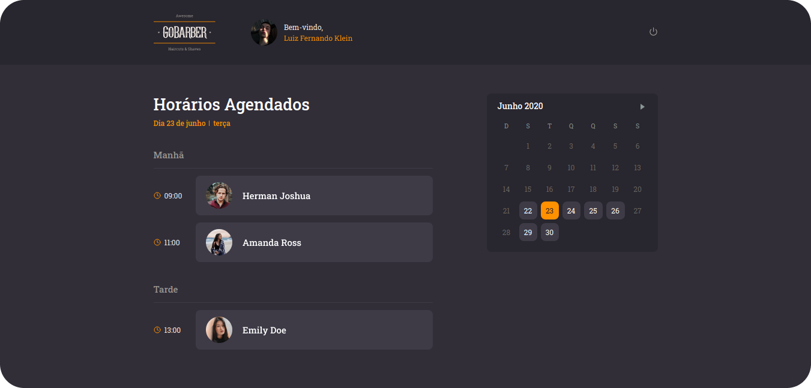

<h1 align="center">
  GoBarber
  <hr />
  
  
  
  <hr />
	
</h1>
<p align="center">
	The application has been created to help people make appointments on your favorite barbershops. Created with Node.js ReactJS and React Native, all with Typescript.
</p>
<h1>Technologies used in this application:<h2>

### Node.js (backend)
- Express
- CORS
- Celebrate
- Nodemailer
- AWS (S3 and SES)
- TypeORM
### React.js (WebClient)
- Axios
- Unform
- Styled Components
- Yup
- React Day Picker
### React Native (MobileClient)
- Axios
- Unform
- Styled Components
- React Navigation

<h1>Get started</h1>

### !!! Requirements
- Node
- Yarn
- MongoDB database
- Redis database
- Postgres database

To start the aplications in your device, first, clone this repository in a new folder. After that, with your terminal, open the folders ```backend```, ```frontend``` and ```mobile``` and run ```yarn``` in each one. After the dependeces instalation, run ```yarn dev:server``` on ```backend``` folder and ```yarn start``` on ```frontend``` folder.

A new tab will be open in your browser with the application.

(Working on mobile)
